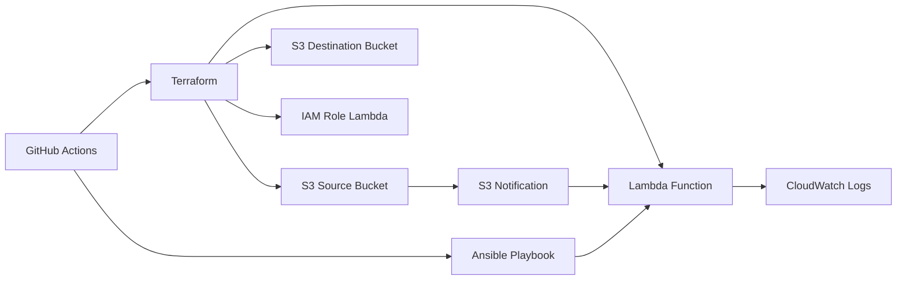

# Architecture du projet `groupe-7-iac`

## 1. Vue d'ensemble

Ce projet provisionne et déploie une petite application AWS basée sur Terraform, Ansible et GitHub Actions.

Objectif principal :
- recevoir un objet dans un bucket S3 source
- déclencher une fonction Lambda
- traiter l'objet
- écrire le résultat dans un bucket S3 de destination

## 2. Composants principaux

### Terraform

Le code Terraform est organisé en deux niveaux :
- `terraform/main.tf` : orchestration globale des modules
- `terraform/modules/lambda` : infrastructure Lambda et IAM
- `terraform/modules/s3_bucket` : création de buckets S3 réutilisables

Ressources créées :
- Bucket S3 source (`<bucket_prefix>-source-grp7`)
- Bucket S3 destination (`<bucket_prefix>-destination-grp7`)
- Fonction Lambda `groupe-7-iac-image-processor-grp7`
- Rôle IAM Lambda `groupe-7-iac-image-processor-grp7-role`
- Politique IAM attachée au rôle Lambda
- Autorisation S3 -> Lambda
- Notification S3 pour déclencher la Lambda
- CloudWatch Log Group pour les logs Lambda

### Ansible

Le playbook Ansible `ansible/playbook.yml` est utilisé pour :
- préparer l’archive de déploiement Lambda
- mettre à jour le code de la fonction Lambda
- synchroniser la configuration runtime si nécessaire

> Le détail du dossier `lambda_build` n’est pas explicitement documenté ici : il s’agit simplement du mécanisme de packaging du code avant envoi.

### GitHub Actions

Le workflow principal se trouve dans `.github/workflows/deploy.yml`.
Il effectue :
- validation du dépôt
- initialisation et déploiement Terraform
- capture des sorties Terraform importantes
- exécution du playbook Ansible pour mettre à jour la Lambda

## 3. Flux de déploiement

Voici le flux global du déploiement :

1. `git push` vers `main`
2. GitHub Actions récupère le code
3. Terraform s'initialise et applique l'infrastructure
4. Terraform crée les buckets, la Lambda et le rôle IAM
5. Le workflow capture l'ARN du rôle Lambda si nécessaire
6. Ansible prépare l'archive et met à jour la fonction Lambda
7. La fonction Lambda est maintenant prête et reliée au bucket source

## 4. Schéma de l'architecture



## 5. Objets et noms utilisés

- `bucket_name_prefix` défini dans `terraform/terraform.tfvars`
- `source_bucket_name` = `<bucket_prefix>-source-grp7`
- `destination_bucket_name` = `<bucket_prefix>-destination-grp7`
- `lambda_name` = `<lambda_name>-grp7`
- `lambda_role` = `<lambda_name>-grp7-role`
- `lambda_policy` = `<lambda_name>-grp7-policy`

## 6. Points de configuration

- région AWS : `eu-west-3` pour l'Ansible et la Lambda
- backend Terraform : défini dans `terraform/main.tf`
- rôle AWS pour GitHub Actions : via `AWS_ROLE_TO_ASSUME` et secrets GitHub
- version Python : `3.11`

## 7. Commandes clés

```bash
cd /home/admuser/groupe-7-iac/terraform
terraform init
terraform plan
terraform apply -auto-approve
```

```bash
cd /home/admuser/groupe-7-iac
git checkout main
ansible-playbook -i "localhost," -c local ansible/playbook.yml
```

## 8. Notes

- La documentation regroupe l'infrastructure, le déploiement et le workflow.
- Elle ne détaille pas la génération interne du répertoire `lambda_build`.
- Le schéma est donné en Mermaid pour une lecture rapide et une visualisation simple.
