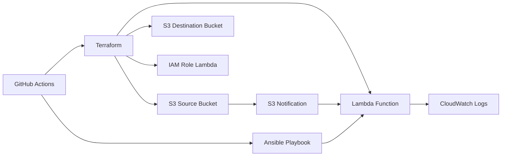

# Projet Groupe 7 IAC

Ce dépôt implémente une architecture AWS avec Terraform, Ansible et GitHub Actions.
L'objectif est de traiter des images déposées dans un bucket S3 source pour générer des PDF dans un bucket S3 destination.

## Architecture générale

- `terraform/` : provisioning de l'infrastructure
- `terraform/modules/` : modules Terraform réutilisables
- `lambda/` : code de la fonction Lambda
- `ansible/` : playbook pour empaqueter et déployer la Lambda
- `.github/workflows/` : pipelines CI/CD GitHub Actions

## Composants

### S3

- Bucket source : `<bucket_prefix>-source-grp7`
- Bucket destination : `<bucket_prefix>-destination-grp7`
- Notification S3 configurée pour déclencher la Lambda lorsque des objets sont ajoutés

### Lambda

- Fonction : `groupe-7-iac-image-processor-grp7`
- Runtime : `python3.11`
- Handler : `handler.lambda_handler`
- Environnement : `DEST_BUCKET`
- Logs : CloudWatch Logs

### IAM

- Rôle Lambda : `${lambda_name}-role`
- Politique Lambda : `${lambda_name}-policy`
- Permissions : journalisation CloudWatch et accès aux buckets S3 source/destination

### Ansible

- `ansible/playbook.yml` package et déploie le code Lambda
- Il installe les dépendances Python dans un dossier local et crée l'archive zip
- Il met à jour la fonction Lambda via AWS CLI

### GitHub Actions

Deux jobs principaux :
- `validate` : vérification du code Terraform et d'Ansible
- `deploy` : déploiement de l'infrastructure et du code Lambda

## Diagramme d'infrastructure



## Fonctionnement

1. Un objet est déposé dans le bucket source
2. S3 envoie une notification à la Lambda
3. La Lambda récupère l'objet, vérifie l'image et tente de convertir en PDF
4. Le PDF est poussé vers le bucket de destination

## Exécution

### Préparer l'environnement local

```bash
cd /home/admuser/groupe-7-iac
python3 -m venv venv
source venv/bin/activate
pip install -r ansible/requirements.txt
```

### Déployer l'infrastructure

```bash
cd terraform
terraform init
terraform plan
terraform apply -auto-approve
```

### Mettre à jour le code Lambda

```bash
cd /home/admuser/groupe-7-iac
ansible-playbook -i "localhost," -c local ansible/playbook.yml
```

## Debug

- Si la Lambda ne peut pas importer `PIL`, vérifier le packaging de Pillow dans le zip Lambda
- Si l'image n'est pas identifiée, vérifier que le fichier cible est bien une image supportée
- Consulter les logs CloudWatch pour les erreurs détaillées

## Formats supportés

- `.jpg`, `.jpeg`
- `.png`
- `.gif`
- `.tiff`
- `.bmp`

## Notes

- Le packaging des dépendances Lambda est géré par Ansible
- Le README décrit l'infrastructure et les étapes de déploiement, sans détailler le build interne du dossier `.lambda_build`
