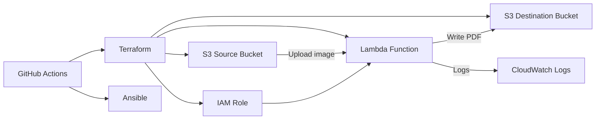
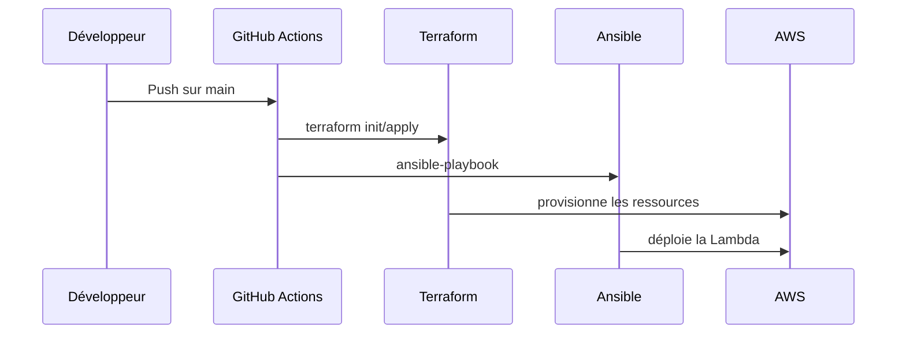
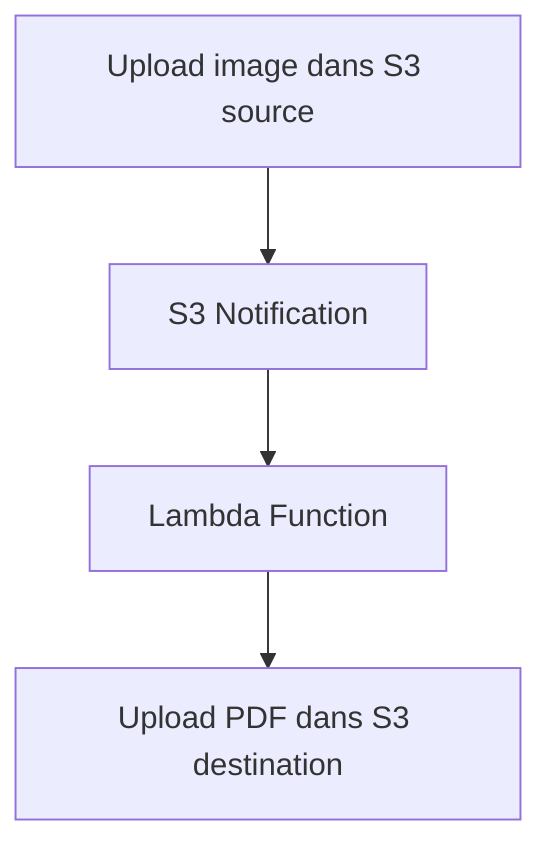

# Projet Groupe 7 IAC

## Objectif

Ce projet met en place une architecture AWS complète pour traiter des images.
Lorsqu’une image est uploadée dans un bucket S3 source, une fonction Lambda est déclenchée pour convertir l’image en PDF et stocker le PDF dans un bucket S3 de destination.

## Structure du dépôt

- `terraform/` : définition de l’infrastructure AWS
- `terraform/modules/` : modules Terraform réutilisables
- `lambda/` : code de la fonction Lambda
- `ansible/` : playbook de packaging et de déploiement Lambda
- `.github/workflows/` : pipelines GitHub Actions
- `ARCHITECTURE.md` : schéma et explication de l’architecture
- `README.md` : documentation utilisateur complète

## Architecture technique

### Ressources AWS principales

- Bucket S3 source
- Bucket S3 destination
- Fonction Lambda
- Rôle IAM pour la Lambda
- Notification S3 pour déclencher la Lambda
- CloudWatch Logs

### Noms prédictibles

La configuration utilise des noms stables et reproductibles :
- `source_bucket_name` = `<bucket_prefix>-source-grp7`
- `destination_bucket_name` = `<bucket_prefix>-destination-grp7`
- `lambda_name` = `<lambda_name>-grp7`
- `lambda_role` = `<lambda_name>-role`
- `lambda_policy` = `<lambda_name>-policy`

## Diagrammes d’architecture

### Schéma global



### Flux de déploiement



### Flux de traitement des images



## Composants détaillés

### Terraform

Le dossier `terraform/` contient l’infrastructure déclarative.

Fichiers clés :
- `terraform/main.tf` : orchestration principale
- `terraform/modules/lambda` : définition de la Lambda, rôle IAM, politiques et permissions
- `terraform/modules/s3_bucket` : création des buckets S3
- `terraform/variables.tf` : paramètres du projet
- `terraform/outputs.tf` : sorties Terraform
- `terraform/versions.tf` : versions providers et backend

Ressources créées :
- Bucket source S3
- Bucket destination S3
- Fonction Lambda
- Rôle IAM Lambda
- Politique IAM
- Notification S3 vers Lambda
- CloudWatch Log Group

### Lambda

La fonction Lambda est définie dans `lambda/handler.py`.

Fonctionnalités :
- récupération du fichier image depuis S3
- validation du format image avec Pillow
- conversion en PDF via `img2pdf`
- écriture du PDF dans le bucket de destination

Variables d’environnement :
- `DEST_BUCKET`

Formats supportés :
- `.jpg`, `.jpeg`
- `.png`
- `.gif`
- `.tiff`
- `.bmp`

### Ansible

Le playbook `ansible/playbook.yml` effectue le packaging et déploie la Lambda.

Étapes :
1. création du répertoire de build local
2. installation des dépendances Python dans le répertoire de build
3. copie du code `handler.py`
4. création de l’archive ZIP de déploiement
5. mise à jour du code Lambda via AWS CLI

### GitHub Actions

Le fichier `.github/workflows/deploy.yml` définit deux jobs principaux :

- `validate` :
  - checkout du code
  - configuration AWS
  - installation de Terraform et Python
  - `terraform fmt` et `terraform validate`
  - installation d’Infracost et génération d’une estimation de coûts
  - exécution de Checkov
  - exécution d’Ansible Lint

- `deploy` :
  - checkout du code
  - configuration AWS
  - installation de Terraform
  - `terraform init` et `terraform apply`
  - exécution du playbook Ansible pour mettre à jour la Lambda

## Déploiement

### Préparer l’environnement local

```bash
cd /home/admuser/groupe-7-iac
python3 -m venv venv
source venv/bin/activate
pip install -r ansible/requirements.txt
```

### Déployer l’infrastructure

```bash
cd terraform
terraform init
terraform plan
terraform apply -auto-approve
```

### Mettre à jour le code Lambda

```bash
cd /home/admuser/groupe-7-iac
ansible-playbook -i "localhost," -c local ansible/playbook.yml
```

## Gestion du state Terraform

- Le projet prend en charge un backend Terraform configuré dans le workflow GitHub Actions.
- Si le backend est local, le fichier `terraform.tfstate` doit être conservé et versionné avec précaution.
- Il est recommandé de ne pas exposer d’état sensible dans Git.

## Debug et erreurs courantes

### `Unable to import module 'handler'`

- le ZIP Lambda n’inclut pas `handler.py`
- la structure du package est incorrecte
- le runtime utilisé n’est pas compatible avec les dépendances

### `cannot identify image file`

- le fichier S3 n’est pas une image valide
- le format n’est pas supporté
- le zip Lambda n’inclut pas les dépendances Pillow correctement

### `Invalid image file`

- Pillow ne peut pas analyser le flux d’octets
- le fichier est corrompu ou non reconnu

### Vérifications utiles

- consulter les logs CloudWatch de la Lambda
- vérifier le contenu de `terraform/lambda_package.zip`
- vérifier la variable d’environnement `DEST_BUCKET`
- vérifier les permissions IAM du rôle Lambda

## Bonnes pratiques

- utiliser des noms stables et reproductibles
- limiter les permissions IAM au minimum nécessaire
- versionner l’infrastructure dans Git
- utiliser des outils de validation et de sécurité
- surveiller CloudWatch pour les erreurs Lambda

## Résumé

Ce projet est conçu pour fournir un pipeline complet de déploiement et d’exécution :
- Terraform provisionne l’infrastructure,
- Ansible déploie le code Lambda,
- GitHub Actions orchestre validation et déploiement.

L’objectif final est de transformer automatiquement des images uploadées dans S3 en fichiers PDF stockés dans un bucket de destination.
